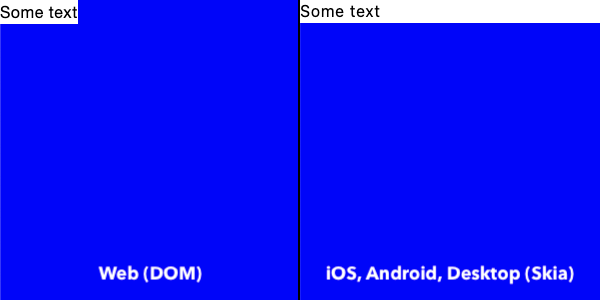
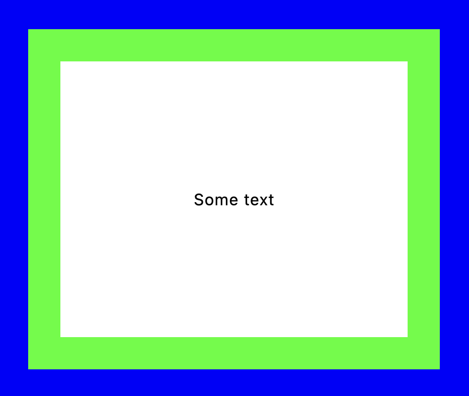
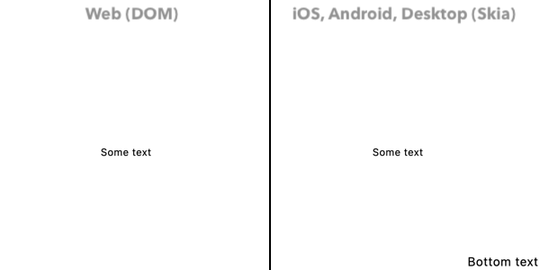

# Cross-Platform Layout Guide

When building cross‑platform apps with **Kdomskia**, there are subtle but important differences between how layouts behave on **Web (DOM)** and **Native (Skia)**.  
Understanding these differences ensures your UI looks consistent everywhere.

## Table of Contents
- [Element Dimensions](#1-element-dimensions)
- [Background and Padding Stack](#2-background-and-padding-stack)
- [Scroll Behaviour](#3-scroll-behaviour)

## 1. Element Dimensions

Consider the following simplified layout tree:

```
Box (Max Size)
└─ Column
   └─ Text (Max Width)
```

### Example

```kotlin
Box(
    modifier = Modifier
        .fillMaxSize()
        .background(Color.Blue)
) {
    Column {
        Text(
            modifier = Modifier
                .fillMaxWidth()
                .background(Color.White),
            text = "Some text"
        )
    }
}
```

### Result



- **On Skia (Native):** the `Text` expands to fill the entire width of the screen.
- **On Web (DOM):** the `Text` only fills the width of its immediate parent. Since the parent `Column` does not expand, the `Text` appears smaller.

This happens because in **CSS**, `width: 100%` is relative only to the direct parent element.  
If the parent itself does not have an explicit width, the child cannot expand as expected.

### Fix

To align behavior across platforms, ensure the parent also fills the maximum width:

```
Box (Max Size)
└─ Column (Max Width)
   └─ Text (Max Width)
```

```kotlin
Box(
    modifier = Modifier
        .fillMaxSize()
        .background(Color.Blue)
) {
    Column(
        modifier = Modifier.fillMaxWidth() // ✅ Parent also expands
    ) {
        Text(
            modifier = Modifier
                .fillMaxWidth()
                .background(Color.White),
            text = "Some text"
        )
    }
}
```

Now both Web and Native render the same layout.

## 2. Background and Padding Stack

In **Compose Multiplatform (Skia)** you can stack multiple `background` and `padding` Modifiers in sequence, and they will render correctly as nested layers.

### Example

```kotlin
Box(
    modifier = Modifier
        .fillMaxSize()
        .background(Color.Blue)
        .padding(32.dp)
        .background(Color.Green)
        .padding(32.dp)
        .background(Color.White)
) {
    Text(
        modifier = Modifier.align(Alignment.Center),
        text = "Some text"
    )
}
```

### Result



On Web (DOM) this does not behave the same way.
This happens because CSS does not allow stacking multiple paddings in sequence — each padding simply overrides the previous one.

### Fix

To reproduce the same visual effect across platforms, wrap your content inside multiple layout composables (Box, Column, or Row) and apply the background / padding separately at each level:

```kotlin
Box(
    modifier = Modifier
        .fillMaxSize()
        .background(Color.Blue)
        .padding(32.dp)
) {
    Box(
        modifier = Modifier
            .fillMaxSize()
            .background(Color.Green)
            .padding(32.dp)
    ) {
        Box(
            modifier = Modifier
                .fillMaxSize()
                .background(Color.White)
        ) {
            Text(
                modifier = Modifier.align(Alignment.Center),
                text = "Some text"
            )
        }
    }
}
```

## 3. Scroll Behaviour

Sometimes you need to design a layout with two distinct layers:
- **Layer 1**: scrollable content
- **Layer 2**: fixed‑position content, which must remain visible while scrolling

### Example

```kotlin
Box(
    modifier = Modifier
        .fillMaxWidth()
        .verticalScroll(
            state = rememberScrollState(),
            domOptions = DomScrollOptions(
                target = DomScrollTarget.Window
            )
        )
) {
    Text(
        modifier = Modifier
            .align(Alignment.Center)
            .padding(vertical = 250.dp),
        text = "Some text"
    )
}
Box(
    modifier = Modifier.fillMaxSize(),
    contentAlignment = Alignment.BottomEnd
) {
    Text(
        text = "Fixed position element"
    )
}
```

### Result



- On **Skia**, the *Fixed position element* remains visible at the bottom.
- On **Web (DOM)**, it scrolls away with the rest of the content.

This happens because in the Web, when the scroll is applied to the `Window`, **all child elements scroll together by default**.

### Fix

Wrap fixed‑position elements inside a `ViewportContainer`.  
This ensures they stay anchored while the rest of the page scrolls.

```kotlin
Box(
    modifier = Modifier
        .fillMaxWidth()
        .background(Color.White)
        .verticalScroll(
            state = rememberScrollState(),
            domOptions = DomScrollOptions(
                target = DomScrollTarget.Window
            )
        )
) {
    Text(
        modifier = Modifier
            .align(Alignment.Center)
            .padding(vertical = 250.dp),
        text = "Some text"
    )
}
ViewportContainer(
    modifier = Modifier.fillMaxSize(),
    contentAlignment = Alignment.BottomEnd
) {
    Text(
        text = "Bottom text"
    )
}
```